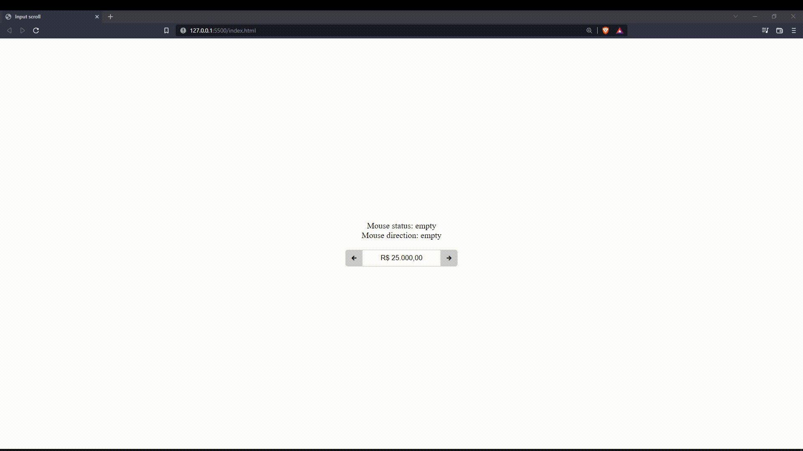

# Atualizando o input pelo movimento do mouse

### Primeira versão
 

> Preview
 

 

Esse código consiste em permitir que o usuário atualize o preço usando o "Segurar e arrastar".

 

## Ícones utilizados 

### <a href="https://icofont.com/">Icofont</a>
<ol>
    <li>
        icofont-arrow-left
    </li>
    <li>
        icofont-arrow-right
    </li>
</ol>